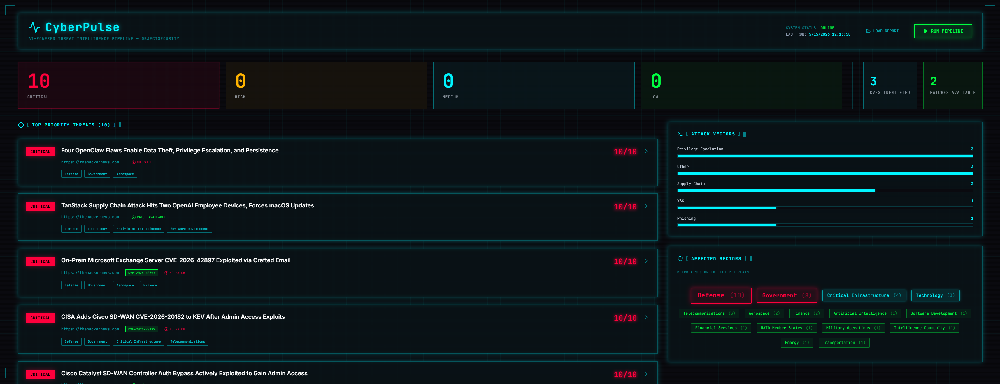
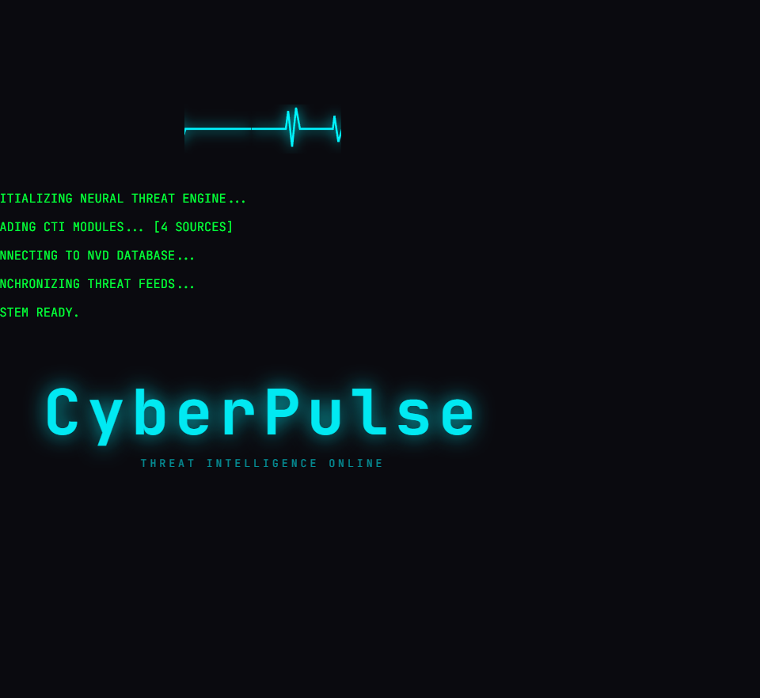
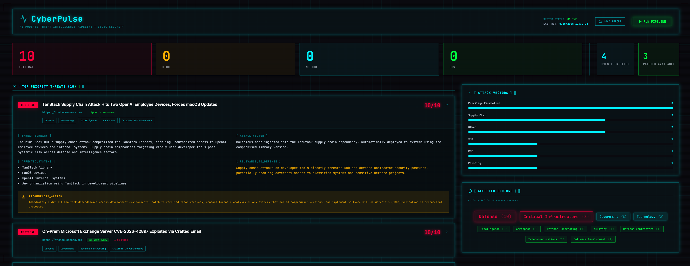
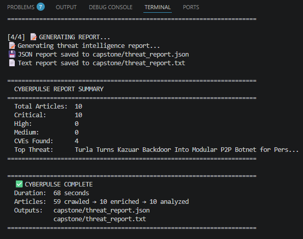

# CyberPulse

**AI-Powered Threat Intelligence Pipeline for Defense Contractors**

CyberPulse is an end-to-end OSINT threat intelligence system that autonomously crawls cybersecurity news sources, enriches articles with structured security metadata, analyzes them from a defense contractor perspective using the Anthropic Claude API, and produces actionable threat reports — all visualized through a real-time futuristic dashboard.



---

## Features

- **Async multi-source crawling** — Simultaneously scrapes The Hacker News, BleepingComputer, and Krebs on Security via Crawl4AI
- **Hybrid CVE extraction** — Combines regex pattern matching with LLM enrichment for accurate vulnerability detection
- **Defense-context threat analysis** — Each article analyzed through a defense contractor analyst prompt, producing structured assessments with priority scoring (1–10)
- **Real-time pipeline execution** — FastAPI backend exposes the full pipeline to a React dashboard with live stage progress
- **Interactive threat dashboard** — Sector-based filtering, expandable threat cards, CVE tracking, and animated cyber-ops aesthetic
- **Structured outputs** — Produces both machine-readable JSON and human-readable text threat reports

---

## Tech Stack

**Backend**
- Python 3.11
- Crawl4AI 0.8.6
- Anthropic Claude API
- LangChain
- FastAPI + Uvicorn
- Pydantic
- asyncio

**Frontend**
- React 18 + TypeScript
- Vite
- Tailwind CSS
- Framer Motion
- Lucide Icons

---

## Architecture

```
┌──────────────┐    ┌──────────────┐    ┌──────────────┐    ┌──────────────┐
│   crawler    │──→ │  extractor   │──→ │   analyzer   │──→ │   reporter   │
│  (Crawl4AI)  │    │ (regex+LLM)  │    │ (Claude API) │    │  (JSON+TXT)  │
└──────────────┘    └──────────────┘    └──────────────┘    └──────────────┘
        │                                                            │
        └────────────────────┬───────────────────────────────────────┘
                             │
                       ┌─────▼─────┐
                       │  FastAPI  │
                       └─────┬─────┘
                             │
                       ┌─────▼─────┐
                       │   React   │
                       │ Dashboard │
                       └───────────┘
```

---

## Setup

### Backend

```bash
cd backend
python -m venv venv
venv\Scripts\activate    # Windows
pip install -r requirements.txt
```

Create a `.env` file in the backend folder:

ANTHROPIC_API_KEY=your-key-here

Start the API server:

```bash
python server.py
```

Server runs at `http://localhost:8000`.

### Frontend

```bash
cd frontend
npm install
npm run dev
```

Dashboard opens at `http://localhost:5173`.

---

## Usage

**Run the pipeline directly:**

```bash
python main.py        # Analyzes 10 articles
python main.py 20     # Analyzes 20 articles
```

**Run from the dashboard:**

Click **RUN PIPELINE** in the header. Real-time stage progress displays in the overlay; the dashboard auto-refreshes when complete.

**Load a previous report:**

Click **LOAD REPORT** and select any `threat_report.json` file.

---

## Pipeline Modules

| Module | Purpose |
|---|---|
| `crawler.py` | Async crawls 3 sources simultaneously, returns structured article list |
| `extractor.py` | CVE regex extraction + Claude-based security field enrichment |
| `analyzer.py` | Defense contractor threat analysis with priority scoring |
| `reporter.py` | Aggregates statistics, generates JSON + text reports |
| `main.py` | Orchestrates the full pipeline end to end |
| `server.py` | FastAPI bridge between pipeline and dashboard |

---

## Sample Output

A typical pipeline run produces:

```json
{
  "title": "Cisco Catalyst SD-WAN Controller Auth Bypass Actively Exploited",
  "cve_ids": ["CVE-2026-20182"],
  "analysis": {
    "threat_level": "Critical",
    "priority_score": 10,
    "affected_systems": ["Cisco Catalyst SD-WAN Controller"],
    "affected_sectors": ["Defense", "Government", "Critical Infrastructure"],
    "recommended_action": "Immediately apply Cisco security updates...",
    "relevance_to_defense": "SD-WAN controllers are critical to DOD network architecture..."
  }
}
```

---

## Screenshots

### Landing Animation


### Real-Time Pipeline Execution


### Threat Intelligence Dashboard


### Expanded Threat Detail with Defense Context


### Pipeline Output


---

## Roadmap

- [ ] Add CISA KEV and MITRE ATT&CK as crawl sources
- [ ] Docker containerization
- [ ] ChromaDB vector store for semantic threat search
- [ ] PostgreSQL persistence layer
- [ ] Scheduled cron-based execution
- [ ] Slack/email alert integrations

---

## License

MIT

---

## Acknowledgments

Built as preparation for a software engineering internship at ObjectSecurity, San Diego — a defense cybersecurity firm specializing in binary vulnerability analysis, supply chain risk, and AI security automation.


Then:

mkdir screenshots
# Save your screenshots into the screenshots/ folder as:
# screenshots/dashboard.png
# screenshots/landing.png
# screenshots/pipeline.png

git add .
git commit -m "Initial commit: CyberPulse v1.0.0"
git branch -M main
# Create the repo on github.com first, then:
git remote add origin https://github.com/Ali-Jabbar-CS/CyberPulse.git
git push -u origin main
git tag -a v1.0.0 -m "v1.0.0 - Full pipeline + dashboard"
git push origin v1.0.0